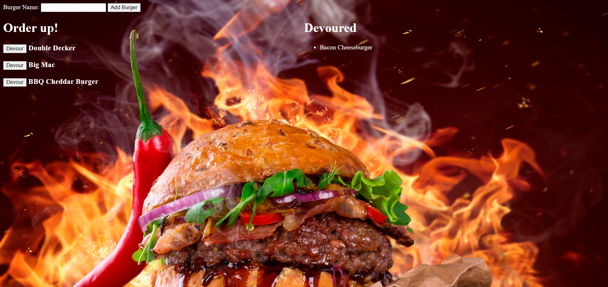

# Burger

## Table of Contents
  * [Description](#description)
  * [Installation](#installation)
  * [Usage](#usage)
  * [License](#license)
  * [Contributing](#contributing)
  * [Tests](#tests)
  * [Questions](#questions)

## Description
A full-stack application that allows the user to create burgers and devour them! Burgers are stored in a MySQL database.

## Installation
Fork and clone the repository, making sure to change your login information for MySQL in the connection.js file in the config folder.

## Usage
This project demonstrates how to design a full-stack application with the Model-View-Controller design pattern.

## License
This project and all of its source code are subject to the MIT license.

## Contributing
Follow the installation guide, then try this out for yourself. If you would like to contribute, either send a pull request on GitHub or see my contact information below.

## Tests
No testing currently exists for this application.

## Questions
Please reach out to me with any questions!

Email: sossw1@gmail.com

GitHub: [sossw1](http://github.com/sossw1)

## Screenshot

